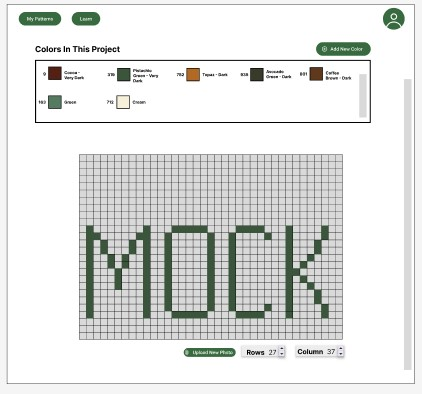
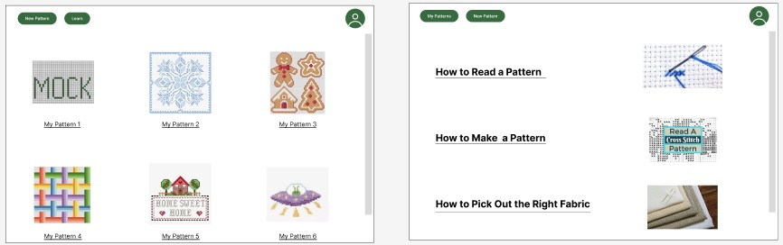
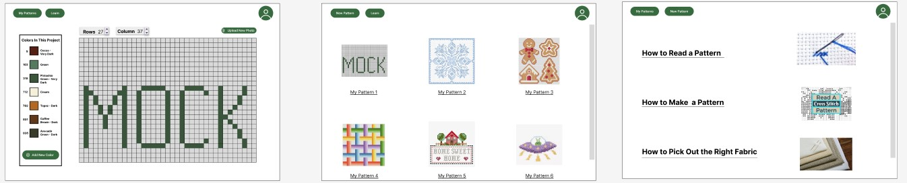
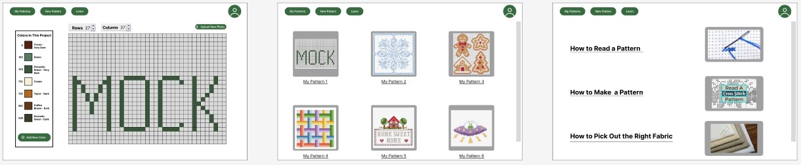
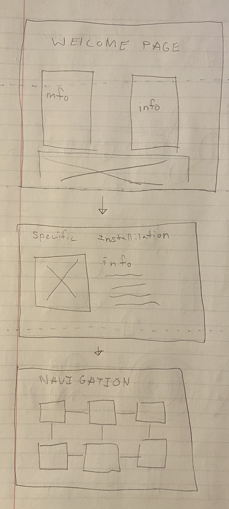

<mark>**Note that this document order from FP4 -> FP1**</mark>

<mark>Please sign up for the study</mark> at [https://tinyurl.com/pui-study](https://tinyurl.com/pui-study) to allow us to use your submission to create a better GenAI assistant for designers!

---

# **FP4 \- Final Project Writeup**

Feel free to refer to this [Markdown Cheat Sheet](https://www.markdownguide.org/cheat-sheet/) to make your writeup more organized, and you can preview your markdown file in VSCode [Markdown editing with Visual Studio Code](https://code.visualstudio.com/docs/languages/markdown#_markdown-preview). 

When deploying the code, GitHub can't find the files necessary for the libraries. When I use the live server to preview my work, the code works just fine.

## Part 1: Website Description

My website is a pattern maker for cross stitch projects. You can change the size of the project, add colors and designs to the grid, and put a photo background behind the grid. 

The target audience of my website are current cross stitch crafters. I didn’t focus on how to do the craft because my audience already knows how to do it. 

The information conveyed by this website is a visual display of the design that a person wants to make. This provides the user with an understanding of what they want to make and the amount of space it might make up. It also lets them understand how different aspects of a design may look next to each other. Additionally, the colors of the threads are displayed both before you choose to add it to the pattern and after. DMC, the main company that makes thread for cross stitch, has hundreds of different colors. My website helps people understand how the different colors will look next to each other and what would look best for your project. 

My website is engaging because it is asking the user to make their project. Without the user’s input, there is no pattern. The input from the user is the single most important aspect of the website. My website is interesting because of all the data I put together for showing the color. It’s important to know the color, name, and number associated with each thread and I wanted to make sure that each was displayed correctly.

## Part 2: User Interaction

1. Text input. Type text into the bar labeled “Add New Thread Color”. You can then click on a name to add it to the project.
2. File input. Click on “Choose File” to add a new photo to the website. This will put a photo behind the grid for the user to use.
3. Select a color. When you hover over each color name a gray background will show up. You are able to click anywhere in that rectangle to access the color.
4. Click to resize the grid. Click the plus or minus button for either the rows or columns to change the size of the grid.
5. Click on the grid. After you select a color, you can change the color of the squares in the grid by clicking each one.
6. Clicking to reset the grid. You can reset the grid to its default state by clicking the “New Pattern” button.
7. Clicking to travel to a new page. You can travel to the DMC learning page by clicking on the “Learn” button.

## Part 3: External Tool
1. Node.js 
   * I used this tool because it was required for the libraries that I chose.
   * I used it to set up the other libraries in my project. 
   * It does not add anything directly to my website, but was needed to set up the other libraries.  
2. AutoComplete.js
   * I chose this tool because I was able to define the terms that were included in the autocomplete feature.
   * I used it to help the user find the specific color they want without needing to know the exact name or spelling.
   * It increases usability because users have more choices and abilities when it comes to finding a new color to use.
3. SweetAlert2.js
   * I chose this library over others because of the amount of customization that it offered and the overall look of the popup.
   * I used to provide information about what the color looks like before it is added and gives the user the choice to cancel that option.
   * It adds more information about a selection and allows the user to cancel a choice.

## Part 4: Design Iteration

The change I made to the design was moving the buttons from the left to the right. By adding the title, this change helped to better balance the website layout and the overall look of the page. I also moved the input for new colors from the bottom of the thread box to the top. As the list of threads gets longer, the user would not need to scroll to add more colors.

## Part 5: Implementation Challenge

My main struggle was with pathing for the different libraries I wanted to use. When trying to use a library, I would need to download the library into my project and then path to it. However, the instructions that were provided by the different websites and documentation did not match what I needed to do and was not helpful to solving the errors.

## Part 6: Generative AI Use and Reflection

I did not use generative AI for my project. I do not like using generative AI for any aspect of my life, especially when I work on coding projects. Since I am still learning how to program with JavaScript, I don’t want to use generative AI so that I can better understand what I am doing and why I am doing it. When working with code, especially in languages that I may not fully understand, understanding where to get new knowledge is an important step in the learning process. With this project I was not just practicing my programming skills, but also practicing my ability to read documentation from all sources. I understand that generative AI is a new tool for gathering information about coding techniques, but I do not currently have enough experience to check the output of the generative AI. It is more important to me to be able to explain how my code works than to do it quickly.

### Usage Reflection

 In [FP2](#generative-ai-use-plan), I mentioned that I may choose to use generative AI to help me create copy or specific information within the website. However, instead of writing the instructions myself, I chose to use some already made directions. I did stick with my plan to not use generative AI. 
  
> Pros and cons of using GenAI tools
* Pros
  1. Condenses information and puts it into one place.
  2. Decreases the amount of time spent on finding information.
* Cons
  1. Ethical implications of using generative AI in general and specifically for designing.
  2. Not knowing where information/data came from.
  3. Not knowing if information is true.
  4. The tendency of generative AI to make up information.
  5. Difficulty with fact-checking information if you don’t already understand the information.

### Usage Log

No logs to document.

---

# **FP3 \- Final Project Check-in**

Document the changes and progress of your project. How have you followed or changed your implementation & GenAI use plan and why? Remember to commit your code to save your progress.

## Implementation Plan Updates

- [x] Week 9 Oct 28 \- Nov 1:
  - [X] FP1 due
  
- [x] Week 10 Nov 4 \- Nov 8:   
  - [x] FP2 due
  - [x] begin implementing layout of new pattern page

- [x] Week 11 Nov 11 \- Nov 15:
  - [x] finish implementing layout of "New Pattern" page
          
- [x] Week 12 Nov 18 \- Nov 22:
  - [x] implement the "Add color" function on the "New Pattern" page
  - [x] implement popup for adding the color to the pattern
        
- [ ] Week 13 Nov 25 \- Nov 29:
  - [ ] implement the grid functionality
  - [ ] implement uploading images 

  - [ ] Thanksgiving  
- [ ] Week 14 Dec 2 \- Dec 6:  
  - [ ] implement feedback provided by TA and class after final presentation
  - [ ] FP4 due

## Generative AI Use Plan Updates

My plan for not using generative AI has not changed.

---

# **FP2 \- Evaluation of the Final project**

## Project Description

This project is a cross stitch pattern maker. This will allow crafters to make their own patterns and base patterns off of pictures. The main motivation for this project is that there is not currently a strong platform to allow people to make their own projects. Crafters want to make things that speak to them, which includes the process of pattern making.

## High-Fi Prototypes

### *Prototype 1*

 

The new pattern screen of this prototype was considered too bulky by the users. They noted that as projects grew and grew, it would be harder to figure out where you are on the grid. Additionally, the buttons for adding rows or columns would be constantly shifting. 

### *Prototype 2*

This prototype was better recieved and the prototype that I used for the usability testing. Users liked that the buttons above the grid would not move as the grid increased or decreased.

## Usability Test

For my usability testing I used a Wizard of Oz methodology. To do this, I showed the user the pattern page first and asked them to complete 4 tasks. First, they were asked to make the "MOCK" pattern based on a guide that I provided them. Second, I asked them to add new colors to their project. Third, I asked them find information about how to read a project. Lastly, I asked them to return to the project that they had previously worked on.

One of the main pieces of feedback that I recieved showed that some portions of the navigation was confusing. This was due to the lack of information about which page the user is currently on. This is something that I want to consider for my final version and incoproprated into the next design. 

## Updated Designs

Based on the feedback I recieved during the usability testing, I updated the screens to include backgrounds behind the images of the second and third screens. Users indicated that this would help to understand where to click and the fact that these images are distinct objects. I also edited the buttons in the navigation to help users understand where they are and recover from potential errors.

## Feedback Summary

One piece of feedback I recieved was to better distinguish the buttons on the design. This includes both distinguishing what page you are on through the buttons and differetiating the different types of buttons. Even though the buttons all do different things, in my updated design, they all look mostly the same. This feedback will infulence my design since I will change some of the components to better communicate inforamtion to the user. Previously, I was focusing mostly on the aesthic of the website, which wouldn't be useful to the user if they couldn't understand where they are within the page.

A second piece of feedback that I recieved is adding a back or undo button as part of the pattern design page. This would allow users to undo actions and go back to the previous pattern. This will influence my design because it will help users to better recover from choices and how they interact with their project. I will put this into my design and I will also spend time considering using a eraser method as well. 

## Milestones

### *Implementation Plan*

- [x] Week 9 Oct 28 \- Nov 1:
  - [X] FP1 due
  
- [ ] Week 10 Nov 4 \- Nov 8:   
  - [x] FP2 due
  - [ ] begin implementing layout of new pattern page

- [ ] Week 11 Nov 11 \- Nov 15:
  - [ ] finish implementing layout of "New Pattern" page
  - [ ] begin implementing layout of "My Patterns" page
  - [ ] begin implementing layout of "Learn" page
  - [ ] finish implementing layout of "My Patterns" page
  - [ ] finish implementing layout of "Learn" page
          
- [ ] Week 12 Nov 18 \- Nov 22:
  - [ ] implement behavior for "My Patterns" page
  - [ ] implement behavior for "Learn" page
  - [ ] implement the "Add color" function on the "New Pattern" page
        
- [ ] Week 13 Nov 25 \- Nov 29:
  - [ ] implement the grid functionality
  - [ ] implement saving to a pdf function
  - [ ] implement uploading images
  - [ ] implement ability to edit images  

  - [ ] Thanksgiving  
- [ ] Week 14 Dec 2 \- Dec 6:  
  - [ ] FP4 due 

### *Libraries and Other Components*

* Jimp.js
* jspdf.node*.js
* autoComplete.js

## Generative AI Use Plan

I do not currently plan to use AI in my implementation. In order to fully understand how my code works and gain the most information from this class, I believe that working on the code entirely on my own is valuable. This includes all portions of the project, including testing. The best way to learn how to do something is to actually do it, not try and figure out how an AI system completed it. While I understand that this method and mindset my hold me back, I do not believe that I am in a place to utilize AI well within the scope of my project. 

If I decide to use generative AI, it will be with writing the content of the learn pages as that is not the main focus of the project. Using the information that generative AI provides to assist with making text seems more reasonable than using generative AI to aid in writing code. 

### *Tool Use*

* ChatGPT  
  * I might use it for helping to writing instructions on how to cross stitch and read patterns because it can help me use language that a novice can understand. It could help me to restate sections or prhase thoughts in a way more accessible to people.
  * I will not use it for coding because it might not be able to help me with actually understanding how to do the work. ChatGPT does not cite its work or thought process, so it can be difficult to understand how the code works or why it would suggest it. You need to be extremely careful when using code from generative AI and I believe I will gain more from writing the code myself.   

### *Responsible Use*

If I choose to use generative AI, I will cite it in any place that I use it. The use of generative AI should be cited the same as any other information that you referecence in your work. In addition, I will check the validity of the information that it provides. I will not just copy and paste outputs into my work without understanding what was given and being able to explain that information.

# **FP1 \- Proposal for Critique**

## Idea Sketches

### *Idea 1: Museum Website*

The basic idea is to be able to experience the feeling of exploring a museum from a website. The website would function by letting the user explore a museum space and look at different exhibits. 

The interaction would happen when people are exploring the space and being able to find out more information about the exhibits by clicking on them. Additionally, I am interested in implementing a “guide” that would be able to tell the information to you. I imagine this guide functioning similarly to old sci-fi robots. I would need to find and use a text to speech library for this aspect of the project. 

One way I plan on making the design accessible is through the use of the guide. I would have it read out the same information that would be presented to the user via text. In this sense, I am using the guide as a proxy for a screen reader, but the functionality is built into the website. I think this would allow the users to feel more comfortable with the website and I hope that people might benefit from something similar to the curb cut effect. The second way I plan on making the design accessible is to make the navigation system simple, but seem complex through the design of the interface. I want it to function like clicking on links so that those using assistive technology have an easier time navigating, but seem more complex.

I want this website to display dinosaur information, such as specific information about different fossils, how fossils form, and the different eras of the earth. I want this website to be generally informational for those who don’t know much about dinosaurs to those who know a moderate amount of information. This would not be a website designed for experts.

### *Idea 2: Cross Stitch Pattern Maker*

The idea of this website is to allow users to design cross stitch patterns. This will include seeing all of the DMC, a specific embroidery thread maker, colors and having a place to edit their designs. 

The main interaction would be placing stitches in the work space, which is the grid seen in the first screen. Users would be able to place a stitch per box. The second interaction will be choosing colors, and users will be able to look up a color by number, color group, or name, which is how DMC allows for searching on their website as well. 

One way I plan on making the design accessible is by using coding techniques that would allow the user to interact with the grid even if they were not able to click on it directly. This would mean that the user could use non-traditional input devices and still make patterns. I also want to make the searching process as intuitive as possible. That’s why I plan to allow users to search in multiple ways. I also want to include an undo button, which will allow users to recover from mistakes easier than if they had to recolor squares individually.

I want this website to display information about the pattern that people are making. When designing a project, it’s important to see how the different colors will look together and how the design looks overall. This information can be difficult to convey depending on how you try to display the grid.

### *Idea 3: Personal Website*

The idea of this website is to convey information about the things that I have done and completed.

The main interaction of this website would be learning about the different projects and exploring the website. The website would be divided into work I did during undergraduate school and work I did during graduate school. Clicking on the different projects would display different information and different images. 

One way that I plan on making this website accessible is to not overuse animations. While animations are interesting, using too many of them may make it harder for people to read or interact with the website. I also plan to follow good practices that allow for screen readers to easily understand what is being displayed.

I want this website to display information about me. This website should communicate the things that I have done and completed in a professional manner. It should also display the skills that I have and how I’ve applied them to my work. I also want this website to display some aspect of my personality, not just information about me.

## Feedback Summary

For the museum website, the feedback centered around the ideas of how navigation would or could work. Since the user would be looking around the space in a way that doesn’t seem linear, it may be more difficult to explain how to use the website and may not be intuitive. One idea that was discussed was helping with wayfinding by using a minimap. Another that was brought up was basing the navigation off how old dungeon crawling games handled navigation: only allow the players to move in the four cardinal directions. In addition, it could be useful to include symbols that point to the directions that the user would be able to travel.

For the cross stitch pattern website, the main critique was on the complexity of the site. Since the website really has 2 main functions, creating and storing projects, it was unclear if it would be complex enough for it to work for the project. One idea that was shared to increase complexity was to allow users to import images and put them behind the grid to follow an existing photo or pattern. Another suggestion was to add a sharing feature that allowed users to see other’s patterns and receive feedback on their own. This would foster collaboration, something that is important to people in crafts. Another thing that was mentioned was that this website had a clear audience and seemed like something that I was personally interested in.

For the personal website, the main critique was that it may not make sense to make this due to the scope of the project. Since most of the choices that would be made would not be interactions with the site, but rather how the information is laid out. While this is an important aspect of interaction, it may not be the intention of this project to focus on it. Being able to lay out a website doesn’t really demonstrate my abilities with coding and creating a usable website. Additionally, it was mentioned that it would be useful to have a project to add to my portfolio, not just to have a portfolio. 
 
## Feedback Digestion

For the museum website, I will definitely incorporate more thought into how the user will navigate the website. I like the idea of borrowing design language from old dungeon video games because video games were important to me growing up. Being able to incorporate something that is reminiscent and nostalgic might give the website a stronger identity, which is something that I definitely want with this project. I’m not sure if I will include symbols that help users understand the directions that they can travel because I don’t want to overwhelm the user with the amount of information that they are presented at any given time. I may try a version with and without the symbols to better understand how it might look and feel.

For the cross stitch pattern website, I would definitely like to include the idea of letting people put images over or under the grid. Part of my inspiration for this website is that there doesn’t seem to be any good websites that allow me to make my patterns. I would appreciate the ability to overlay images, so I believe that other crafters would be interested in it as well. I do not think I will include a social aspect because I am not interested in trying to make a website that allows users to share information between each other and I don’t want to try to handle moderation that needs to occur when sharing work. If the scope of the project was different, I might be more interested in this idea.

For the personal website, the main critiques had to do with the scope of the project in relation to the project definition. Based on this, if I choose to implement this, I may not continue with trying to iterate with this idea. If it is a mismatch for this project, it might make sense to think of a different project or focus on the other ideas. 

